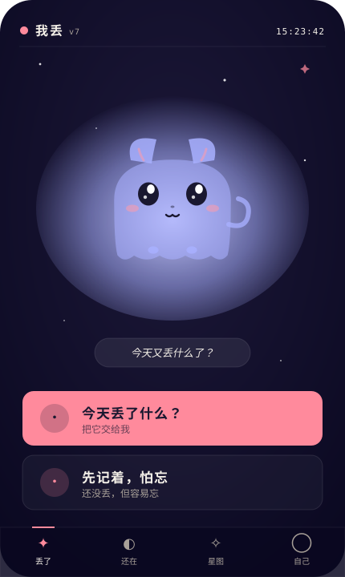
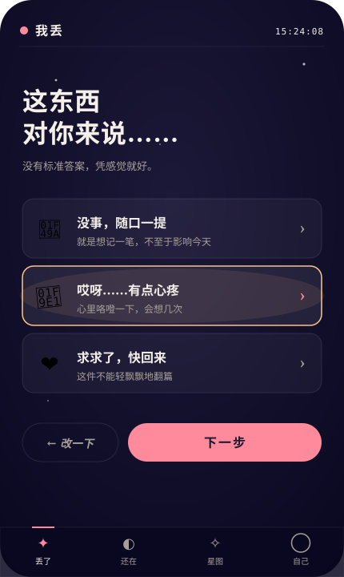
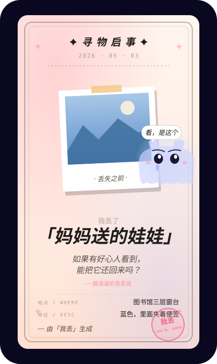
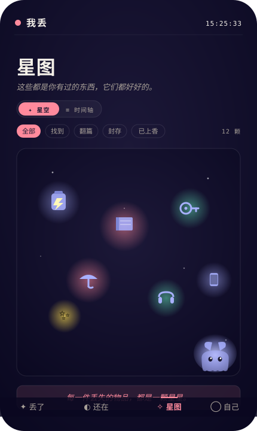

<div align="center">



<br>

# 我 丢

**把脑子里悬着的那件事，交给它管着。**

*一个给丢三落四的人做的轻量疗愈工具。*

[](https://github.com/wangranm-a11y/wodiu/actions/workflows/lint.yml)
[](https://wangranm-a11y.github.io/wodiu/)
[](https://wangranm-a11y.github.io/wodiu/)
[](#license)
[](#)

[**🌐 在线体验**](https://wangranm-a11y.github.io/wodiu/) · [PRD](#-设计) · [技术栈](#-技术栈) · [本地预览](#-本地预览)

</div>

---

## ✨ 是什么

> 我是一个经常丢东西的人。丢了之后，真正让我难受的不是那件东西不在了——是脑子里一根悬着的弦，一直在那儿。
>
> 后来我发现这背后有一个心理学效应，叫**蔡格尼克效应**：未完成的事，会持续占用我们的认知资源。但一旦你把它「记下来」，大脑就会觉得「这件事有人管了」，你就可以去想别的了。
>
> 「我丢」就是这么来的。它不是帮你找东西的，也不是帮你假装那件事没发生的。它只是帮你把脑子里悬着的东西接过去——然后说：「记下了，走吧。」

整个产品围绕一只叫 **丢丢** 的萌幽灵猫展开 —— 它是主视觉、是搭子、是接收悬而未决之事的容器。

---

## 📱 预览

<table>
<tr>
<td></td>
<td></td>
<td></td>
<td></td>
</tr>
<tr align="center">
<td><b>首屏 · 丢丢主视觉</b><br><sub>背对 → 转头 → 舔屏</sub></td>
<td><b>情感分级</b><br><sub>💚 🧡 ❤️ 三档</sub></td>
<td><b>寻物卡</b><br><sub>丢丢 + 照片 + 求助语</sub></td>
<td><b>星图</b><br><sub>已结案的物件 ✦</sub></td>
</tr>
</table>

---

## 🌟 功能

| 模块 | 做什么 |
|---|---|
| **丢了** | 情感分级 → 寻物 / 翻篇 / 疗愈三条路径 |
| **还在** | 「先记着」+「寻找中」合并管理悬而未决的事 |
| **星图** | 已结案的物件以 **星空 ✦ + 时间轴 ≡** 双视图查看 |
| **赛博上香** 🕯 | 长按 3 秒点火 + 烟雾上升 + 钟磬，电子告别仪式 |
| **寻物卡** | Canvas 生成的暖心寻物卡，带丢丢 + 可选照片，一键分享 |
| **下一段旅程** | AI 织一段奇幻小故事，描写物件离开后的新生活 |
| **背景音乐** 🎵 | 三种合成的环境音乐：☀ 温暖（F 大调）/ ☾ 月光（D 多利亚）/ ≋ 海风（A 五声 + 浪声）|
| **关于我丢** | 蔡格尼克效应理念页 |

---

## 🎨 设计

整体调性：**「暗夜柔糖」**

- 深靛蓝底 `#0a0820` + 散落星点 + 玻璃磨砂卡片
- 唯一暖色 `#ff8a9c` 珊瑚粉（主 CTA / 强调）
- 紫雾光晕 `#a8b0ff` 仅出现在丢丢周围
- 心情三档：💚 `#5fd9b0` / 🧡 `#ffc58a` / ❤️ `#ff8a9c`

字体（CDN 加载）：
- **得意黑** Smiley Sans（标题）
- **LXGW 文楷** WenKai Screen（正文）
- **JetBrains Mono**（时间 / 编号）

更多设计细节见 PRD：`我丢_PRD_v6.docx`。

---

## 🛠 技术栈

零构建、零依赖、纯静态：

```
HTML  · 单页 + PWA manifest + Service Worker
CSS   · CSS variables + glassmorphism + 自定义动画
JS    · 原生 ES6，无框架
Canvas 2D       — 寻物卡 Canvas 生成
Web Audio API   — 音效 + 三主题背景音乐合成
Vibration API   — 触感反馈
SVG inline      — 丢丢萌幽灵猫 + 星图物品图标
localStorage    — 数据本地化（无后端）
pollinations.ai — AI 文本 / 插图（匿名 API，超时回退本地）
```

---

## 🚀 本地预览

```bash
git clone https://github.com/wangranm-a11y/wodiu.git
cd wodiu
python3 -m http.server 8765
# 打开 http://localhost:8765/index.html
```

不需要 `npm install`、不需要 build。

---

## 📲 安装为 App（PWA）

在手机浏览器打开 [wangranm-a11y.github.io/wodiu](https://wangranm-a11y.github.io/wodiu/)：

- **iOS Safari**：底部分享 → 添加到主屏幕
- **Android Chrome**：右上角菜单 → 安装应用

装完后图标在桌面，**离线可用**、支持系统通知 + 振动 + 一键分享寻物卡。

---

## 🧪 开发笔记

- 数据全部 `localStorage`，换设备不同步（V2 计划上账号系统）
- AI 配图依赖 [pollinations.ai](https://pollinations.ai)，匿名免费但不稳定，14 秒超时后回退本地 SVG 兜底
- 通知 / 振动 / 音乐都需要用户首次手势触发（浏览器策略）
- Service Worker 缓存所有静态资源，更新时改 cache version 触发重拉

---

## 📂 文件结构

```
wodiu/
├── index.html             — 单页主入口
├── styles.css             — 全部样式
├── app.js                 — 主逻辑
├── mascot.js              — 丢丢 SVG 生成器（chibi 萌幽灵猫）
├── icons.js               — 物品图标自动匹配
├── sounds.js              — Web Audio 音效 + 背景音乐合成
├── findcard.js            — 寻物卡 Canvas 渲染
├── incense.js             — 赛博上香交互
├── starmap.js             — 星图星空视图
├── ai.js                  — pollinations.ai 调用 + 兜底
├── copy.js                — 全部文案库（每场景 6-10 条轮换）
├── manifest.json          — PWA manifest
├── sw.js                  — Service Worker
├── icons/                 — App 图标 (192/512)
├── assets/
│   ├── og-image.svg       — 社交分享卡 (1200×630)
│   └── preview/           — README 预览图
└── .github/workflows/
    └── lint.yml           — CI 语法检查
```

---

## 🔮 后续规划

- [ ] 账号体系 + 云同步
- [ ] 丢丢成长系统（解锁皮肤）
- [ ] 年度回顾长图
- [ ] AI 生成卡通插画（V2）
- [ ] 桌面小组件
- [ ] 更多丢丢主题音乐

---

## License

MIT © wangranm-a11y · 2026

<div align="center">

<sub>需要的时候它在 ✦</sub>

</div>
